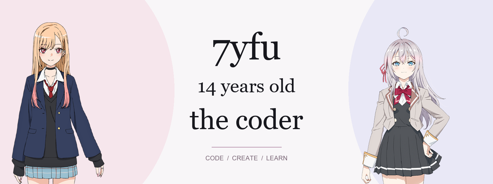

  

### about

14-year-old coder. Learning, experimenting, and building things one project at a time.

I like code, anime, and making ideas work.

---

### toolbox

  

- **code:** Python · Java · HTML
- **workflow:** Git · GitHub
- **mindset:** learn by building

---

### activity

Character artwork: [Marin Kitagawa — My Dress-Up Darling](https://bisquedoll-anime.com/character/) · [Alya Kujou — Roshidere](https://roshidere.com/chara/alisa.html). All character artwork belongs to its respective owners.
