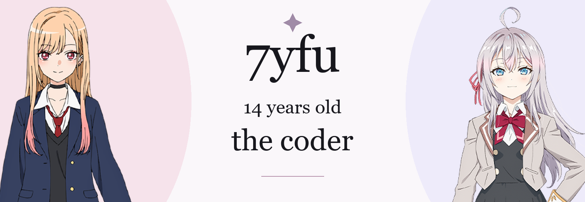
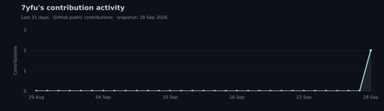

  

### about

**14-year-old developer, learning by building.**

I enjoy turning small ideas into working projects, experimenting with code, and understanding how things work under the hood. Python, Java, and the web are where I’m building my foundations.

My goal is to write clearer code, learn from each project, and keep improving through practice. When I’m away from the editor, I’m usually enjoying anime — especially Marin Kitagawa and Alya Kujou.

---

### toolbox

  

- **code:** Python · Java · HTML
- **workflow:** Git · GitHub
- **mindset:** learn by building

---

### right now

Starting fresh. Exploring new ideas, improving the fundamentals, and making each project a little better than the last.

---

### contribution activity

Public contribution snapshot from GitHub, updated 28 September 2026.

Character artwork: [Marin Kitagawa — My Dress-Up Darling](https://bisquedoll-anime.com/character/) · [Alya Kujou — Roshidere](https://roshidere.com/chara/alisa.html). All character artwork belongs to its respective owners.

